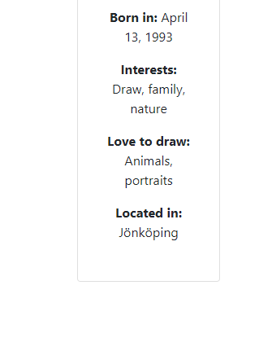

# R.H ARTSHOP
RH Artshop is a full-stack, responsive website built for selling art and art products.

The site provides the user value in viewing already made art by the artist, and the ability to make a custom request to get a personal tailored concept of art.
The site also lets visitors to create their own account to be able to add items, remove items, change quantity of items and viewing their items in the shopping cart.

[Link to the live website](https://project-four-4.herokuapp.com/)

## Table of Contents
* [Overview](#overview)
* [Agile Methodology](#agile-methodology)
* [User Experience (UX)](#user-experience-ux)
    * [Strategy / Site Goals](#strategy--site-goals)
    * [Structure / Design Choices](#structure--design-choices)
* [Features](#features)
    * [Existing Features](#existing-features)
    * [Future Features](#future-features)
* [Technologies Used](#technologies-used)
* [Testing](#testing)
* [Bugs](#bugs)
* [Deployment](#deployment)
    * [Forking the GitHub Repository](#forking-the-github-repository)
    * [Creating a Local Clone](#creating-a-local-clone)
* [Credits](#credits)

[Back To Top](#rh-artshop)

___
## Overview

R.H Artshop is a responsive, mobile-first build website. It is compatible with all current major browsers. The website is built for educational purposes, using Bootstrap and the Django Framework. It gives users the ability to register for an account, add items to the cart and changing their password. It includes role-based permissions and full CRUD functionality on items inside their cart.

[Back To Top](#table-of-contents)

___

## Agile Methodology

Screenshots of project board, Epics and User Stories

[Back To Top](#table-of-contents)
___
## User Experience (UX)

### Strategy / Site Goals

RH Artshop targets people interested in art, giving them the chance to discover another very talented artist who's willing to sell his/her art and also make custom art pieces. The site aims to be a easily navigated webshop, providing easy access to information that will benefit the user. 

The target audience are adults who loves art. 
___
### Scope / User Stories

This section aims to determine what a user would expect from interacting with the website. Each User Story was recorded in [GitHub Issues](https://github.com/Undie92/proj-4/issues). Scenarios of actions each type of user, including the business owner, wishes to take are listed below. Developer User Stories were also added to this section.

**As a Visitor**
* As a user/visitor I can sort the content so that I can browse content easily. [#17](https://github.com/Undie92/proj-4/issues/17)
* As a visitor I can register my own account so that i can browse the full website. [#2](https://github.com/Undie92/proj-4/issues/2)
* As a visitor I can easily navigate so that I can find artist's social medias.[#11](https://github.com/Undie92/proj-4/issues/11)
* As a visitor I can navigate so that i can recieve info about the artist. [#3](https://github.com/Undie92/proj-4/issues/3)
* As a visitor I can view the store so that i can view the content. [#1](https://github.com/Undie92/proj-4/issues/1)

**As a User**
* As a user I can manage my account so that I can log out of my account. [#19](https://github.com/Undie92/proj-4/issues/19)
* As a user I can register an account so that I can log into my account. [#18](https://github.com/Undie92/proj-4/issues/18)
* As a user/visitor I can sort the content so that I can browse content easily. [#17](https://github.com/Undie92/proj-4/issues/17)
* As a user I can manage my cart content so that checkout and place the order. [#16](https://github.com/Undie92/proj-4/issues/16)
* As a user I can manage my account so that I can contact support. [#15](https://github.com/Undie92/proj-4/issues/15)
* As a User I can manage my account so that I can return an order. [#14](https://github.com/Undie92/proj-4/issues/14)
* As a user I can manage my account so that I can change my user information. [#13](https://github.com/Undie92/proj-4/issues/13)
* As a user I can manage my account so that I can view my orders. [#12](https://github.com/Undie92/proj-4/issues/12)
* As a user I can contact the artist so that I can send an idea of a custom motive. [#9](https://github.com/Undie92/proj-4/issues/9)
* As a user I can manage my account so that I can change my password. [#8](https://github.com/Undie92/proj-4/issues/8)
* As a user I can easily access so that I can see the total price of my cart. [#7](https://github.com/Undie92/proj-4/issues/7)
* As a user I can remove items so that change the content of my cart. [#6](https://github.com/Undie92/proj-4/issues/6)
* As a user I can change amount of items so that i can buy multiple items. [#5](https://github.com/Undie92/proj-4/issues/5)
* As a user I can add items to cart so that i can buy art. [#4](https://github.com/Undie92/proj-4/issues/4)
* 

**As a Admin / Site Owner**
* As a Site Admin I can access the database so that I can add / remove content from the shop. [#10](https://github.com/Undie92/proj-4/issues/10)
* As a Admin/Site Owner I can easily click a button so that I can add newly created products to the shop. [#21](https://github.com/Undie92/proj-4/issues/21)
* As a Admin/Site Owner I can click a button so that I easily can access admin panel. [#20](https://github.com/Undie92/proj-4/issues/20)
* As a admin I can add pagination so that products split up in a number of pages. [#22](https://github.com/Undie92/proj-4/issues/22)
___
### Structure / Design Choices

The website offers simplicity and consistency within its structure. Its structure was designed to be responsive on screens from 320px up to 2560px.

The navigation menu displays the RH Artshop logo and a hamburger button (on mobile) with links to the Home, About, Shop, Cart (if logged in), Logout (if logged in, else Login) and My Account (if logged in). 
The shop section got a dropdown list with 4 branches, All Products, Posters, Canvas and Frames. 

The Footer displays social media links which open in a separate tab for ease of use. It also displays "Copyright © Rebecka Hellström 2023(auto updated year).
The footer is repeated across all pages to keep the design all through.

The Home Page is acting like the landing page, with a simple picture and a button to take you directly to the shop. 

The About Page gives a bit more description of the Artist, who she is, and what she likes to do on her spare time. 

The Registration & Authentication Pages, also accessed through the Navigation Menu are simple to use.

The Account Page is only accessable by logged in users, and offers the user to change password, view orders, change user information, return orders, make custom poster request and last but not least, contact support if something has has gone wrong (most of these are not yet developed, as they are under construction, due to this beeing a project 4 fullstack development, did not have time to finish all the content as the project would have been as big as a project 5 website.)

The Products Page, gives the user a view of all the products available for purchase, where the user can filter through all the contents of the shop very easily by a click. Every product has a button to add the item to the cart, aswell as another button to redirect the user to a more detailed productview. 

Detailed Productview, this is where the user is redirected after pressing "View Item" presenting a bigger picture of the product, aswell as an add to cart button, a back button (to take you back to the all products page) and description of the product.

Cart Page, this page is accessed by users logged in and it shows all the products the user has put in the cart, and the total price of all the products, together with a checkout button (which is not implemented yet, also due to time constraint and not needed in the project 4)

 

 
The Database models used for this project

* **The Category Model**
    - name
    - slug
* **The Products Model**
    - category (FK)
    - name
    - slug
    - description
    - price
    - created_at
    - featured_image
    - quantity
* **The Cart Model**
    - user (FK)
    - product (FK)
    - product_qty
    - created_at
 

[Back To Top](#table-of-contents)
___

## Features

### Existing Features

**Header & Navigation**

Featured on all pages, the fully responsive header includes:

* R.H Artshop clickable text to redirect user to the frontpage
* Home clickable link to redirect user to the frontpage
* About clickable link to redirect user to About page, where user can read some info about the artist
* Shop dropdown list containing "All Products, Canvas, Frames, Posters" each link redirecting to the appropriate part of the shop
* If on mobile device, a hamburger button contains all the links above
* If logged in, Cart button which redirects user to the cart
* If logged in, Logout button that redirects user to a logout confirmation screen
* If logged in, My Account button that redirects user to their account page
* If not logged in, Login button that redirects user to login page
* If not logged in, Register button that redirects user to signup page

Click to view screenshots of Navigation features

        Navigation closed on mobile  

        Navigation open on mobile

        Navigation open for logged user mobile

        Navigation on tablets & desktops

        Navigation for logged user on tablets & desktops

 

**Footer**

Featured on all pages, the responsive footer is valuable to the users as it encourages users to keep connected via social media. It includes:

* Instagram button that redirects user to the artists instagram by opening in a new tab or window
* Facebook button that redirects user to Facebook (for now as artist don't have a facebook page yet) by opening in a new tab or window
* TikTok button that redirects user to the artists TikTok by opening in a new tab or window
* Copyrighted message with the always updating current year.

Click to view screenshots of Footer features

        Footer on mobile

        Footer on tablet & desktops

 

**Landing Page / Home Page**

The home page / landing page quickly shows the visitor what kind of website this is, and what the website expects from the user. It includes:

* A welcome text
* A button that redirects user to the shop section of All Products Page
* A picture of a color palette and brushes.

Click to view screenshots Landing page features

        Landing page on mobile

        Landing page on tablet

        Landing page on desktop

 

**About Page**

The about page gives the visitor some insight in the artists life and creating a person behind the art that is beeing sold. It contains: 

* A introduction of the artist for the user to read
* A picture of the artist
* Some quick fun facts below the picture

Click to view screenshots of the About page

        About page on mobile

        About page on desktop

        About page on tablet

 

**Products Page**

The product page gives the visitor the ability to scroll through all the different art that is for sale, as well as frames & canvases. It also allows the user to quickly filter through the items in the product page to only see what the user is interested in. It contains: 

* A 4 item list containing filter options of "All Products, Canvas, Frames, Posters"
* A Product Card of each product that the shop offers
* Ability to change quantity before adding to cart
* Name of every product
* Price of every product

Click to view screenshots of the Products Page

        Products on mobile

        Products page on desktop

 

**Registration**

The registration page allows user to register on the page to keep browsing and buying products. It contains: 

* Name field
* Email field (optional for now, as i have not yet implemented automation for emails)
* Password field
* Repeat Password field

Click to view screenshots

 

**Login**

The Login page offers the user to correctly sign into the website with their registered account, to be able to fully use all features the website offers.

* Name field
* Password field
* Login button
* Forgot Password button (This feature has not yet been implemented, as in, not configured, nor styled with CSS, but it do exist)

Click to view screenshots

 

**Logout**

The logout feature redirects the user to a logout confirmation screen, to make sure that the user actually wants to logout.

* Logout button
* Text to verify the user that they actually wants to logout

Click to view screenshots

 

**Cart**

The cart is accessible by logged in users and consists a list of all items put into the cart by the logged in user, aswell as showing price per unit & total price.

* Product Card for each product in the cart
* Ability to change quantity
* Ability to remove item from the cart
* Checkout button (which is not yet implemented)
* Total Price

Click to view screenshots

        Cart Page on Mobile 

        Cart Page on Desktop

 

**Detailed Productview**

The Detailed productview appears when a user clicks on the "View Item" button on any of the products on the shopping page. Showing a bigger picture of the product, aswell as some description of the item together with price of the unit.

* Big responsive picture of the product
* Add to cart button
* Ability to change quantity before adding to cart
* Back button that redirects user back to the previous visited page

Click to view screenshots

        Detailed Productview on Mobile 

        Detailed Productview on Desktop

 

**Admin Panel**

The Admin panel features all the models for the database, aswell as the "for now" ability to add more items to the store (will be implemented directly to the website in the future for admin / site owner to add products quick and easy)

* Dashboard
* Products model
* Category model
* User model
* Cart model
* About model
* Index model (homepage picture, hosted by cloudinary for static file upload)

Click to view screenshots

        Reaching the Admin Panel

        Django Administration Login Page

        Django Administration Interface

        Django Administration Interface for Categories

        Django Administration Interface for Products

 

[Back To Top](#table-of-contents)

___

### Future Features

* Ability to add items to the store from website instead of having to use admin interface.
* Ability to checkout your cart and actually place an order.
* Ability to change the user information, from the account view.
* Ability to return an already delivered order.
* Ability to view your placed orders, aswell as updating it if you forgot something, or even cancel the order completely.
* Ability to contact the support team of the website, to ask any questions the user has.
* Add a button for admin/business owner and appropriate users to access admin panel directly without having to change address manually.
* Setup a automated mail system.
* Add ability to make reviews to every product when a product has been ordered.
* Add ability for user to request a new password via "Forgot Password form"

[Back To Top](#table-of-contents)

___

## Technologies Used

### Languages
* [HTML5](https://www.w3schools.com/html/)
* [CSS3](https://www.w3schools.com/css/css_intro.asp)
* [Python](https://www.python.org/downloads/release/python-3112/)

### Libraries & Frameworks

* [Django 4.1.17](https://www.djangoproject.com/) - Free and open source Python Web Framework
* [Gunicorn 20.1.0](https://gunicorn.org/) - A Python WSGI HTTP server compatible with Django and used to run the project on Heroku
* [Pyscopg2 2.9.5](https://www.psycopg.org/docs/) - A PostgreSQL database adapter for Python
* [Cloudinary](https://cloudinary.com/) - A persistent file store for media
* [Heroku](https://www.heroku.com) - A cloud platform as a service
* [ElephantSQL](https://www.elephantsql.com/) - PostgreSQL database hosting service
* [SQLite3](https://docs.python.org/3/library/sqlite3.html) - The database provided by Django
* [Django Allauth](https://django-allauth.readthedocs.io/en/latest/) - Integrated set of Django applications addressing authentication and registration
* [Bootstrap 5.1.3](https://getbootstrap.com/docs/5.1/getting-started/introduction/) - A Framework for building responsive, mobile-first sites
* [dj-database-url 1.2.0](https://pypi.org/project/dj-database-url/) - A django database connection dictionary
* [django-jazzmin 2.6.0](https://django-jazzmin.readthedocs.io/) - Django Jazzmin, a more advanced and styled admin dashboard

### Tools

* [GitHub](https://github.com/) - Cloud based git repository used
* [W3C Validator](https://validator.w3.org/) - A validator which checks the markup validity of Web documents in HTML, XHTML, SMIL, MathML, etc
* [W3C CSS Validation Service](https://jigsaw.w3.org/css-validator/) - A validator which checks the validity of CSS code
* [Code Institute's Python Linter](https://pep8ci.herokuapp.com/) - Highlights syntactical and stylistic problems in Python source code
* [Chrome DevTools and Lighthouse](https://developer.chrome.com/docs/devtools/) - Web Developer Tools
* [bootstrap@1.10.3](https://icons.getbootstrap.com/) - Icons

[Back To Top](#table-of-contents)

___

## Testing

### Google Developer Tools

For every page of the website, i used Lighthouse to check the rating all pages got.

Check screenshots for Lighthouse ratings on mobile

When looking at the score and ratings for the webpage on a mobile, i understand that i should have used a compression program to compress the images before using them, and also look at the scripts & stylesheets as it states that they are render-blocking resources, increasing loading time.

Check screenshots for Lighthouse ratings on desktop

When looking at the score and ratings for the webpage on a desktop, i understand that i should have used a compression program to compress the images before using them.

## Manual Testing

___

 Nav Bar For All Pages 

TEST            | OUTCOME                          | PASS / FAIL  
--------------- | -------------------------------- | ---------------
Home page | When clicking on the home link on the nav bar, the browser redirects to the home page. | PASS
About page | When clicking on the about link on the nav bar, the browser redirects to the about page | PASS
Shop dropdown list | When clicking on the shop link on the nav bar, the dropdown list shows all categories, aswell as "All Products" clicking on each item takes the user to the correct page  | PASS
Cart | If the user is logged in, they will have the cart button active and visible, allowing the user to access the cart page containing all items put into the cart | PASS
My Account | When user is logged in, they will have access to the My Account button in the nav bar to be able to access their account | PASS
Log in / Log Out Pages | When clicking on the log in or log out button the page redirects to the log in page or leads to confirmation page to log user out | PASS
Register Page | When clicking on the register button it redirects to the register page | PASS
Foreground and background | Checked foreground and background information is clearly legible | PASS
Text | Checked the text is clearly legible against the background | PASS

Footer For All Pages

TEST            | OUTCOME                          | PASS / FAIL  
--------------- | -------------------------------- | ---------------
Instagram button | When clicking the Instagram button, it opens a new window to access that page and also redirects to the artist's profile | PASS
Facebook button | When clicking the Facebook button, it opens a new window to access that page | PASS
TikTok button | When clicking the TikTok button, it opens a new window to access that page and also redirects to the artist's profile | PASS

Home Page

TEST            | OUTCOME                          | PASS / FAIL  
--------------- | -------------------------------- | ---------------
Responsiveness | Checked elements for consistant scaleability | PASS
Accessibility | Checked the accessibility of the page using lighthouse | PASS

About Page

TEST            | OUTCOME                          | PASS / FAIL  
--------------- | -------------------------------- | ---------------
Responsiveness | Checked elements for consistant scaleability | PASS
Media | All media assets are displayed properly, have no pixelation or stretched images and is responsive on all devices | PASS
Accessibility | Checked the accessibility of the page using lighthouse | PASS

All Products Page

TEST            | OUTCOME                          | PASS / FAIL  
--------------- | -------------------------------- | ---------------
Responsiveness | Checked elements for consistant scaleability | PASS
All Products | When arriving to the all products page, you are presented with a list containing 4 items for filtering through categories, aswell getting access to all products available in the shop | PASS
Canvas | When clicking canvas in the list, the webpage filters all products in the category canvas to show all canvas products | PASS
Frames | When clicking frames in the list, the webpage filters all products in the category frames to show all frames products | PASS
Posters | When clicking posters in the list, the webpage filters all products in the category posters to show all poster products | PASS
Pagination keeps category filter | When filtering products and accessing next page, the pagination system keeps the filter active | PASS
Add To Cart Button | If user is not logged in, user gets alerted by alertify to log in before adding items to the cart. If user is logged in, add to cart button adds item to the cart | PASS
View Item Button | When user clicks View Item, the website redirects to Detailed Product Page for the correct item with unique site address | PASS
Accessibility | Checked the accessibility of the page using lighthouse | PASS

Detailed Product Page

TEST            | OUTCOME                          | PASS / FAIL  
--------------- | -------------------------------- | ---------------
Responsiveness | Checked elements for consistant scaleability | PASS
Increment and Decrement buttons | When clicking increment or decrement button the quantity that you will add to cart increases or decreases | PASS
Add to cart button | When clicking Add to cart button, it adds as many pieces of the product as the value says in the box | PASS
Back button | When clicking back button, it takes you back to the page you previously were on before the detailed product page | PASS 
Accessibility | Checked the accessibility of the page using lighthouse | PASS

Cart Page

TEST            | OUTCOME                          | PASS / FAIL  
--------------- | -------------------------------- | ---------------
Cart | The cart correctly shows the amount of products that the user has put into the cart, how many of each piece, and the correct price of each product aswell as total price for all | PASS
Increment and Decrement buttons | When clicking increment or decrement button the quantity that you will add to cart increases or decreases | PASS
Add to cart button | When clicking Add to cart button, it adds as many pieces of the product as the value says in the box | PASS
Remove button | When clicking remove button on a product, it correctly removes the product and updates the div containing all products | PASS
Media | All media assets are displayed properly, have no pixelation or stretched images and is responsive on all devices | PASS
Responsiveness | Check every element on-page for consistent scalability in mobile, tablet and desktop view | PASS
Accessibility | Checked the accessibility of the page using lighthouse| PASS

Register Page

TEST            | OUTCOME                          | PASS / FAIL  
--------------- | -------------------------------- | ---------------
Responsiveness | Check every element on-page for consistent scalability in mobile, tablet and desktop view | PASS
Accessibility | Checked the accessibility of the page using lighthouse| PASS
Register form | Checked the form submits only when all required fields are filled out. | PASS
Creating account | When register form has correctly been filled and user press sign up, the user is then created in the database, ready to be used | PASS
Sign in link | Checked the sign-in link redirects to the login page | PASS

Login Page

TEST            | OUTCOME                          | PASS / FAIL  
--------------- | -------------------------------- | ---------------
Responsiveness | Check every element on-page for consistent scalability in mobile, tablet and desktop view | PASS
Accessibility | Checked the accessibility of the page using lighthouse | PASS
Sign in form | Checked the form submits only when all required fields are filled out. | PASS
Sign In button | Checked that the button correctly signing in the user and redirecting to the Home Page | PASS
Signup link | Checked the signup link redirects to the signup page | PASS

Change Password Page

TEST            | OUTCOME                          | PASS / FAIL  
--------------- | -------------------------------- | ---------------
Responsiveness | Check every element on-page for consistent scalability in mobile, tablet and desktop view | PASS
Accessibility | Checked the accessibility of the page using lighthouse | PASS
Change Password Form | Checked the form submits only when all required fields are filled out. | PASS
Change Password | Checked that the button correctly changes the users password | PASS
Forgot Password | Checked Forgot Password button correctly redirects user to Forgot Password form | PASS

Forgot Password Page

Have not yet tested this page, as i have not setup a correct way to send emails automaticly. As my project already is too big for pp4 plan.

Therefore i have not changed the CSS to match accordingly with the footer leaving alot of white space on the bottom of the page, but i am aware that it does that.

Make A Custom Poster Request Page

TEST            | OUTCOME                          | PASS / FAIL  
--------------- | -------------------------------- | ---------------
Responsiveness | Check every element on-page for consistent scalability in mobile, tablet and desktop view | PASS
Accessibility | Checked the accessibility of the page using lighthouse | PASS
Sign in form | Checked the form submits only when all required fields are filled out. | PASS
Sign In button | Checked that the button correctly signing in the user and redirecting to the Home Page | PASS
Signup link | Checked the signup link redirects to the signup page | PASS

[Back To Top](#table-of-contents)

___

### Bugs

JavaScript was not loaded correctly

Whenever i set Debug = False for deploying to Heroku, the application gave me this error: 
"Refused to execute script from 'https://res.cloudinary.com/undie/raw/upload/v1/static/js/scripts.d41d8cd98f00.js' because its MIME type ('image/gif') is not executable."
I took help from the student tutor assistance, to find out what the problem was. And after alot of troubleshooting we changed the jQuery script to CDN link instead of static file, aswell as adding defer to the original JavaScript file that had the custom code in it. By doing that, we made sure that jQuery loaded in before the custom Script and finally made the jQuery script work, so the remove button and increment function finally worked as it should've! 

When i ran collectstatic in my terminal

It threw me an error, saying "keyerror: 'etag'", after hours and hours of googling and asking my mentor, we never found a solution. So my mentor redirected me to Tutor Assistance once again, and they helped me sort this problem out. The reason i got that message was because of Cloudinary, for some reason it could not overwrite the existing items in the cloudinary database, and therefore failed to collect static files. So we removed the static folder and tried to collect static again, and then it finally worked!

[Back To Top](#table-of-contents)

___

## Deployment

For good practice, this project was deployed early to [Heroku](https://www.heroku.com) in order to save time and avoid nasty surprises later on.

After installing Django and the supporting libraries, the basic Django project was created and migrated to the database. 

The database provided by Django [db.sqlite3](https://docs.python.org/3/library/sqlite3.html) is only accessible within the workspace environment. In order for Heroku to be able to access the database, a new database suitable for production needs to be created.  Heroku offers a postgres add-on at an extra charge. I am using a postgreSQL database instance hosted on [ElephantSQL](https://www.elephantsql.com/) as this service is free. 

Steps taken before deploying the project to Heroku

### Create the Heroku App

1. Login to Heroku and click on the top right button ‘New’ on the dashboard. 
2. Click ‘Create new app’.
3. Give your app a unique name and select the region closest to you. 
4. Click on the ‘Create app’ button.

### Create the PostgreSQL Database

1. Login to ElephantSQL and click on the top right button ‘Create New Instance’.
2. Give your plan the name of the project and select the Tiny Turtle (Free) plan.  The ‘Tags’ field can be left empty.  
3. Click on ‘Select Region’ and select a data centre near you and click ‘Review’.  
4. Make sure your plan is correct and click ‘Create Instance’. 
5. Return to the dashboard and click on this project’s instance you just created. This will open up the “Details” page where the link to the URL is displayed.  This needs to be added to the env.py file in the project’s directories.

First Deployment

1. Go back to the Heroku dashboard and click on the ‘Deploy’ tab.  
2. For deployment method, select ‘GitHub’ and search for the project’s repository from the list. 
3. Select and then click on ‘Deploy Branch’.  
4. When the build log is complete it should say that the app has been successfully deployed.
5. Click on the ‘Open App’ button to view it and the Django “The install worked successfully!” page, should be displayed. 

Final Deployment

1. When development is complete, if you had left `DEBUG = True` in the settings.py file, make sure to change it to `False`. You don't have to change anything if you had used `DEBUG = 'DEVELOPMENT' in os.environ` as your env.py file is ignored by GitHub. 
2. Commit and push your code to your project's repository.
3. Then open up Heroku, navigate to your project's app. Click on the 'settings' tab, open up the config vars and delete the DISABLE_COLLECTSTATIC variable. 
4. Navigate to the 'Deploy' tab and scroll down to 'Deploy a GitHub branch'.
5. Select the branch you want to deploy and click on the 'Deploy branch' button. When the app is deployed, you should see a message in the built log saying "Your app was successfully deployed".  Click 'View' to see the deployed app in the browser. Alternatively, you can click on the 'Open App' button at the top of the page. 

___

### Forking the GitHub Repository

Steps to Fork the GitHub Repository

Forking allows you to view and edit the code without affecting the original repository

1. Locate the GitHub repository. Link to this repository can be found [here](https://github.com/MoniPar/tailors_thimble).
2. Click on 'Fork', in the top right-hand corner.
3. This will take you to your own repository to a fork with the same name as the original branch.

___

### Creating a Local Clone

Steps to Creating a Local Clone

1. Go to the GitHub repository. Link to this repository can be found [here](https://github.com/MoniPar/tailors_thimble).
2. Click on 'Code' to the right of the screen. This will open a dropdown. Click on HTTPs and copy the link.
3. Open Git Bash in your IDE and change the current working directory to the location where you want the cloned directory.
4. Type `git clone`, paste the URL you copied earlier, and press Enter to create your local clone.

More information on Creating and Managing repositories can be found [here](https://docs.github.com/en/repositories/creating-and-managing-repositories/cloning-a-repository)
 

[Back To Top](#table-of-contents)

___

## Credits

### Code

The following walkthroughs helped me out on getting inspiration and motivation about how to style and setup the ecommerce webpage

* Code Institute's learning material which is found in the CI's LMS for the Diploma in Software Development.
* [SharmaCoder - Django Ecommerce series for inspiration](https://www.youtube.com/@SharmaCoder/videos)

Pages I Referred to a lot:

* [Django Documentation](https://docs.djangoproject.com/en/3.2/)
* [Bootstrap Documentation](https://getbootstrap.com/docs/4.6/getting-started/introduction/)
* [Django Allauth](https://django-allauth.readthedocs.io/en/latest/)
* [jQuery Documentation](https://api.jquery.com/)

Other pages, questions and tutoring that helped me:

* My mentor, Adegbenga Adeye
* Student Tutoring - JavaScript related questions, see bugs.
* Slack - Django related questions.

[Back To Top](#table-of-contents)

___